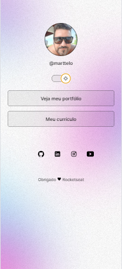

<h1 align="center"> DEVLINKS </h1>

Desenvolvendo habilidades em HTML, CSS e JAVASCRIPT

  <a href="#-tecnologias">Tecnologias</a>&nbsp;&nbsp;&nbsp;|&nbsp;&nbsp;&nbsp;
  <a href="#-projeto">Projeto</a>&nbsp;&nbsp;&nbsp;|&nbsp;&nbsp;&nbsp;
  <a href="#-layout">Layout</a>&nbsp;&nbsp;&nbsp;|&nbsp;&nbsp;&nbsp;
  <a href="#memo-licença">Licença</a>

  

 

  

## 🚀 Tecnologias

Esse projeto foi desenvolvido com as seguintes tecnologias:

- HTML e CSS
- JavaScript
- Git e Github
- Figma

## 💻 Projeto

O Devlink é um projeto que serve como cartão de visitas on-line

## 🔖 Layout

Você pode visualizar o layout do projeto através [DESSE LINK](./assets/Layout2.png).

## :memo: Licença

Esse projeto está sob a licença MIT.

---

